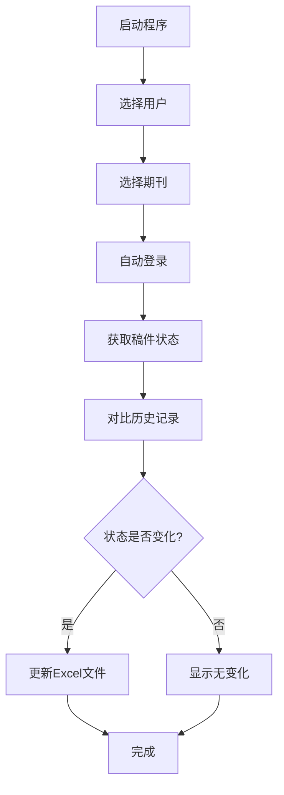

<div align="center">

# 📄 Editorial Manager Tracker

**🔬 专业的学术期刊稿件状态自动追踪工具**

[](https://python.org)
[](LICENSE)
[](CONTRIBUTING.md)
[](https://github.com/taozhe6/em-tracker)

[快速开始](#-快速开始) •
[功能演示](#-功能演示) •
[安装指南](#-安装指南) •
[使用文档](#-使用文档) •
[常见问题](#-常见问题)

---

**📊 专为使用 Editorial Manager 系统的学术期刊设计，让稿件追踪变得简单高效**

*支持 Gastroenterology、The Lancet 系列、American Journal of Gastroenterology 等数百种期刊*

</div>

## 🚀 快速开始

### ⚡ 三步启动

```bash
# 1. 克隆项目
git clone https://github.com/taozhe6/em-tracker.git
cd em-tracker

# 2. 安装依赖
pip install -r requirements.txt

# 3. 配置并运行
python add_config.py  # 添加期刊账户
python main.py        # 开始追踪
```

### 🎯 首次使用

```bash
# 创建虚拟环境（推荐）
python -m venv em-tracker-env
source em-tracker-env/bin/activate  # Linux/macOS
# em-tracker-env\Scripts\activate   # Windows

# 一键安装
pip install -r requirements.txt && python add_config.py
```

## 📺 功能演示

<div align="center">

### 🖥️ 命令行界面
*清晰的彩色输出，实时显示追踪进度*

### 📊 Excel报告示例
*自动生成的专业追踪报告*

| 时间戳 | 投稿日期 | 状态日期 | 当前状态 | 稿件编号 |
|--------|----------|----------|----------|----------|
| 2024-01-15 10:30 | 2024-01-10 | 2024-01-15 | Under Review | MS2024-001 |
| 2024-01-20 09:15 | 2024-01-10 | 2024-01-19 | Decision Made | MS2024-001 |

### 📁 智能文件组织
```
data/
├── researcher1@university.edu/
│   ├── MS2024-001_Innovative-Treatment-Approach/
│   │   └── Innovative-Treatment-Approach_投稿追踪.xlsx
│   └── MS2024-002_Clinical-Trial-Results/
│       └── Clinical-Trial-Results_投稿追踪.xlsx
└── researcher2@hospital.org/
    └── ...
```

</div>

## ✨ 核心功能

<table>
<tr>
<td width="50%">

### 🎯 智能追踪
- ✅ **自动状态检测** - 智能识别稿件状态变化
- ✅ **历史记录管理** - 完整的时间线追踪
- ✅ **多期刊支持** - 支持所有EM系统期刊
- ✅ **批量处理** - 一次查询所有稿件

</td>
<td width="50%">

### 📊 专业报告
- ✅ **Excel格式输出** - 专业格式化表格
- ✅ **自动文件管理** - 智能文件夹组织
- ✅ **状态变更提醒** - 高亮显示重要变化
- ✅ **数据持久化** - 安全的本地存储

</td>
</tr>
<tr>
<td width="50%">

### 🔒 隐私安全
- ✅ **本地数据存储** - 所有数据保存在本地
- ✅ **临时账户模式** - 无需保存敏感信息
- ✅ **配置文件保护** - 自动忽略敏感配置
- ✅ **网络安全** - 模拟真实浏览器请求

</td>
<td width="50%">

### 🛠️ 用户体验
- ✅ **彩色命令行** - 友好的视觉反馈
- ✅ **智能重试** - 网络异常自动恢复
- ✅ **交互式配置** - 向导式设置流程
- ✅ **错误处理** - 详细的错误信息和解决建议

</td>
</tr>
</table>

## 🌍 支持的期刊
 
### 📚 **通用支持说明**
 
> 💡 **本工具支持所有使用 Editorial Manager 系统的期刊** - 只需要找到期刊的EM简称即可使用
 
<div align="center">
 
**✅ 理论上支持 1000+ 期刊，覆盖各个学科领域**
 
</div>
 
### 🏥 经过测试的期刊示例
 
<div align="center">
 
| 学科领域 | 期刊名称 | 简称 | 测试状态 |
|:--------:|:--------|:----:|:--------:|
| **消化内科** | Gastroenterology | `GASTRO` | ✅ 已验证 |
| **消化内科** | Gut | `GUT` | ✅ 已验证 |
| **消化内科** | American Journal of Gastroenterology | `AJG` | ✅ 已验证 |
| **消化内科** | Inflammatory Bowel Diseases | `IBD` | ✅ 已验证 |
| **综合医学** | The Lancet | `LANCET` | ✅ 已验证 |
| **综合医学** | The Lancet Gastroenterology & Hepatology | `LANGAS` | ✅ 已验证 |
| **眼科学** | Eye and Vision | `EYE` | ✅ 已验证 |
| **神经科学** | Nature Neuroscience | `NN` | 🔶 理论支持 |
| **心血管** | Circulation | `CIRC` | 🔶 理论支持 |
| **肿瘤学** | Journal of Clinical Oncology | `JCO` | 🔶 理论支持 |
 
</div>
 
### 🔍 如何确认期刊支持？
 
<div align="center">
 
**3步验证法**
 
</div>
 
1. **📝 访问期刊投稿页面** - 查看是否使用Editorial Manager系统
2. **🔗 检查URL格式** - `editorialmanager.com/[期刊简称]/` 
3. **🧪 使用临时账户测试** - 选择"手动输入临时账户"进行验证
 
**常见期刊简称查找示例：**
https://www.editorialmanager.com/gastro/     → GASTRO
https://www.editorialmanager.com/ibd/        → IBD

https://www.editorialmanager.com/eye/        → EYE
https://www.editorialmanager.com/circulation/ → CIRCULATION

## 📦 安装指南

### 系统要求

- **Python**: 3.7+ 
- **操作系统**: Windows / macOS / Linux
- **网络**: 稳定的互联网连接

### 方式一：标准安装（推荐）

```bash
# 克隆项目
git clone https://github.com/taozhe6/em-tracker.git
cd em-tracker

# 创建虚拟环境
python -m venv venv
source venv/bin/activate  # Linux/macOS
# venv\Scripts\activate   # Windows

# 安装依赖
pip install -r requirements.txt
```

### 方式二：直接下载

1. 点击 [Download ZIP](https://github.com/taozhe6/em-tracker/archive/main.zip)
2. 解压到本地文件夹
3. 进入文件夹运行：`pip install -r requirements.txt`

### 方式三：开发者安装

```bash
# Fork 项目后克隆
git clone https://github.com/YOUR_USERNAME/em-tracker.git
cd em-tracker

# 安装开发依赖
pip install -r requirements.txt
pip install -r requirements-dev.txt  # 如果有的话
```

## 📖 使用文档

### 🎯 基本工作流程



### 🔧 配置账户

#### 使用配置助手（推荐）

```bash
python add_config.py
```

按提示输入：
- **期刊全名**: `Gastroenterology`
- **期刊简称**: `GASTRO` 
- **用户名**: 您的EM账户用户名
- **密码**: 您的EM账户密码

#### 手动配置

创建 `config.py` 文件：

```python
ACCOUNTS = [
    {
        'journal_short_name': 'GASTRO',
        'journal_full_name': 'Gastroenterology',
        'username': 'your_username',
        'password': 'your_password'
    },
    # 可以添加多个期刊账户
]
```

### 🚀 运行程序

```bash
python main.py
```

程序将显示交互式菜单：

```
============================================================
 Journal Manuscript Tracker (v31.1)
============================================================

请选择要查询的用户:
  [1] researcher@university.edu (3本期刊)
  [2] doctor@hospital.org (1本期刊)
  [3] 手动输入临时账户进行查询
  [Q] 退出程序

请输入您的选择:
```

### 📊 理解输出结果

#### 🟢 成功案例
```
[步骤 1] 正在初始化登录流程...
正在尝试登录 'Gastroenterology'...
  - 第 1 次尝试...

[成功] 登录成功！

[步骤 2] 正在获取主菜单页面...
  - 成功！已获取主菜单HTML。

--- 正在处理: Innovative Treatment Approach for IBD... (MS#: MS2024-001) ---
  - [状态更新!] 发现新状态或状态日期变更。
    - 旧状态: Under Review (2024-01-15)
    - 新状态: Decision Made (2024-01-20)
    - 历史记录已更新并重新格式化: Innovative-Treatment-Approach_投稿追踪.xlsx
```

#### 🟡 无变化案例
```
--- 正在处理: Clinical Trial Results... (MS#: MS2024-002) ---
  - [状态未变] 当前状态与上次记录相同: Under Review
```

#### 🔴 错误处理
```
[失败] 登录失败。请检查用户名、密码或期刊简称。
```

## 🔧 高级功能

### 🔒 临时账户模式

适用于：
- 🎯 偶尔查询其他期刊
- 🔐 不想保存敏感账户信息
- 🧪 测试新期刊配置

选择"[3] 手动输入临时账户"即可使用。

### 📁 自定义数据存储

默认数据存储在 `data/` 文件夹，您可以修改：

```python
# 在 main.py 中找到这行
username_dir = os.path.join('data', account['username'])

# 修改为自定义路径
username_dir = os.path.join('/your/custom/path', account['username'])
```

### 🎨 自定义界面颜色

如果您不喜欢彩色输出：

```bash
# 卸载 colorama
pip uninstall colorama

# 程序会自动降级为纯文本模式
```

## ❓ 常见问题

> 💡 **提示**: 点击下方问题标题可以展开详细答案
<details>
<summary><strong>🔐 登录相关问题</strong></summary>

### Q: 登录失败怎么办？
**A**: 检查以下几点：
1. ✅ 用户名密码是否正确
2. ✅ 期刊简称是否正确（区分大小写）
3. ✅ 网络连接是否稳定
4. ✅ 期刊网站是否可以正常访问

### Q: 如何找到正确的期刊简称？
**A**: 
1. 访问期刊的Editorial Manager页面
2. 查看URL，如：`editorialmanager.com/gastro/` → 简称是 `GASTRO`
3. 或者联系期刊编辑部询问

### Q: 支持双因素认证(2FA)吗？
**A**: 目前不支持。如果期刊启用了2FA，建议使用临时账户模式手动处理。

</details>

<details>
<summary><strong>📊 数据和文件问题</strong></summary>

### Q: Excel文件被占用怎么办？
**A**: 程序会自动检测并提示：
```
[操作暂停] 文件 'xxx.xlsx' 正被另一程序占用。
请关闭该Excel文件后，按 Enter键 继续...
```
关闭Excel文件后按Enter即可。

### Q: 如何备份我的追踪数据？
**A**: 直接复制整个 `data/` 文件夹即可。

### Q: 可以修改Excel文件格式吗？
**A**: 可以修改 `main.py` 中的Excel写入部分，或者提交Feature Request。

</details>

<details>
<summary><strong>🛠️ 技术问题</strong></summary>

### Q: 为什么推荐使用虚拟环境？
**A**: 虚拟环境的好处：
- 🔒 隔离项目依赖，避免版本冲突
- 🧹 保持系统Python环境干净  
- 📦 便于项目迁移和分享
- 🛡️ 避免权限问题

### Q: 程序运行很慢怎么办？
**A**: 
1. 检查网络连接速度
2. 尝试修改 `config.py` 中的超时设置
3. 如果稿件很多，属于正常现象

### Q: 支持代理服务器吗？
**A**: 目前不支持，但您可以通过系统代理或修改requests配置实现。

</details>

<details>
<summary><strong>🆕 新功能请求</strong></summary>

### Q: 能否支持其他期刊系统？
**A**: 目前专注于Editorial Manager系统。如有其他需求，请提交Issue讨论。

### Q: 能否添加邮件通知功能？
**A**: 这是一个很好的想法！请在Issues中提交Feature Request。

### Q: 能否支持API接口？
**A**: 期刊网站通常不提供公开API，目前只能通过网页抓取实现。

</details>

## 🤝 贡献指南

我们欢迎所有形式的贡献！

### 🌟 如何贡献

1. **🍴 Fork 本项目**
2. **🌿 创建特性分支** (`git checkout -b feature-amazing-feature`)
3. **💾 提交更改** (`git commit -m 'Add some amazing feature'`)
4. **📤 推送到分支** (`git push origin feature-amazing-feature`)
5. **🎯 提交 Pull Request**

### 📝 贡献类型

- 🐛 **Bug 修复** - 发现并修复问题
- ✨ **新功能** - 添加实用的新功能
- 📚 **文档改进** - 完善README和代码注释
- 🎨 **代码优化** - 提升代码质量和性能
- 🧪 **测试覆盖** - 添加单元测试和集成测试

### 🏷️ Issue 标签

- `bug` - 程序错误
- `enhancement` - 功能增强
- `documentation` - 文档相关
- `good first issue` - 适合新手
- `help wanted` - 需要帮助

## 📄 许可证

本项目基于 [MIT License](LICENSE) 开源。

```
MIT License

Copyright (c) 2024 em-tracker contributors

Permission is hereby granted, free of charge, to any person obtaining a copy
of this software and associated documentation files (the "Software"), to deal
in the Software without restriction...
```

## 🙏 致谢

### 🌟 特别鸣谢

<div align="center">

**感谢以下项目和个人为本工具的发展提供灵感和支持**

</div>

#### 🔬 **开源项目致谢**

<table align="center">
<tr>
<td align="center" width="50%">

**🎯 [pyeditorialmanager](https://github.com/glichtner/pyeditorialmanager)**

*Python interface for querying the editorialmanager journal submission system*

由 [@glichtner](https://github.com/glichtner) 开发

**贡献**: 为EM系统的Python接口开发提供了重要参考和灵感

</td>
<td align="center" width="50%">

**📊 [Meta_script](https://github.com/slee0709/Meta_script)**

*Editorial Manager Submission Tracker*

由 [@slee0709](https://github.com/slee0709) 开发  

**贡献**: 早期EM追踪工具的探索为本项目提供了宝贵思路

</td>
</tr>
</table>

#### 👥 **社区贡献者**

<div align="center">

<!-- 贡献者头像墙 -->
<a href="https://github.com/taozhe6/em-tracker/graphs/contributors">
  
</a>

**每一个Star、Fork、Issue和PR都是对项目的宝贵支持！**

</div>

#### 🏥 **研究社区**

- 🔬 **全球研究者社区** - 您的使用反馈让工具不断改进
- 🏥 **医学研究机构** - 为学术进步提供的宝贵建议  
- 📚 **期刊编辑部** - 对自动化工具的理解和支持
- 👨‍💻 **开发者社区** - 在Issues中提供的技术支持和建议

#### 🛠️ **技术框架致谢**

<div align="center">

| 项目 | 版本 | 用途 | 感谢理由 |
|:----:|:----:|:----:|:--------|
| **[requests](https://requests.readthedocs.io/)** | 2.25+ | HTTP请求处理 | 优雅简洁的API设计 |
| **[pandas](https://pandas.pydata.org/)** | 1.3+ | 数据处理分析 | 强大的数据操作能力 |
| **[beautifulsoup4](https://www.crummy.com/software/BeautifulSoup/)** | 4.9+ | HTML解析 | 直观的网页内容提取 |
| **[colorama](https://pypi.org/project/colorama/)** | 0.4+ | 跨平台彩色终端 | 提升用户界面体验 |
| **[xlsxwriter](https://xlsxwriter.readthedocs.io/)** | 3.0+ | Excel文件生成 | 专业的表格格式化 |

</div>

### 💝 **特殊致谢**

> **献给所有为学术研究默默奉献的研究者们**
> 
> *您的每一篇论文投稿，每一次状态查询，都是在推动人类知识的边界。*
> *这个小工具能为您节省一点时间，让您专注于更重要的研究工作，就是我们最大的荣幸。*

<div align="center">

**🌟 如果这个工具对您的研究工作有帮助，请给我们一个 Star！**

*您的支持是我们持续改进的动力* ⭐

</div>

---

### 📬 **联系我们**

- 🐛 **Bug报告**: [提交Issue](https://github.com/taozhe6/em-tracker/issues/new?template=bug_report.md)
- 💡 **功能建议**: [功能请求](https://github.com/taozhe6/em-tracker/issues/new?template=feature_request.md)  
- 🤝 **参与开发**: [查看贡献指南](CONTRIBUTING.md)
- 📧 **直接联系**: 通过GitHub私信联系维护者

<div align="center">

**Made with ❤️ for the global research community**

*让学术投稿追踪变得简单而高效*

[⬆ 回到顶部](#-editorial-manager-tracker)

</div>
